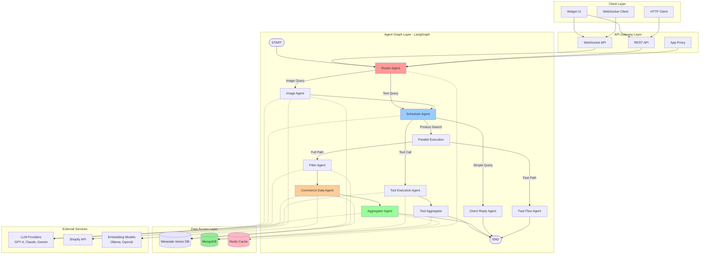
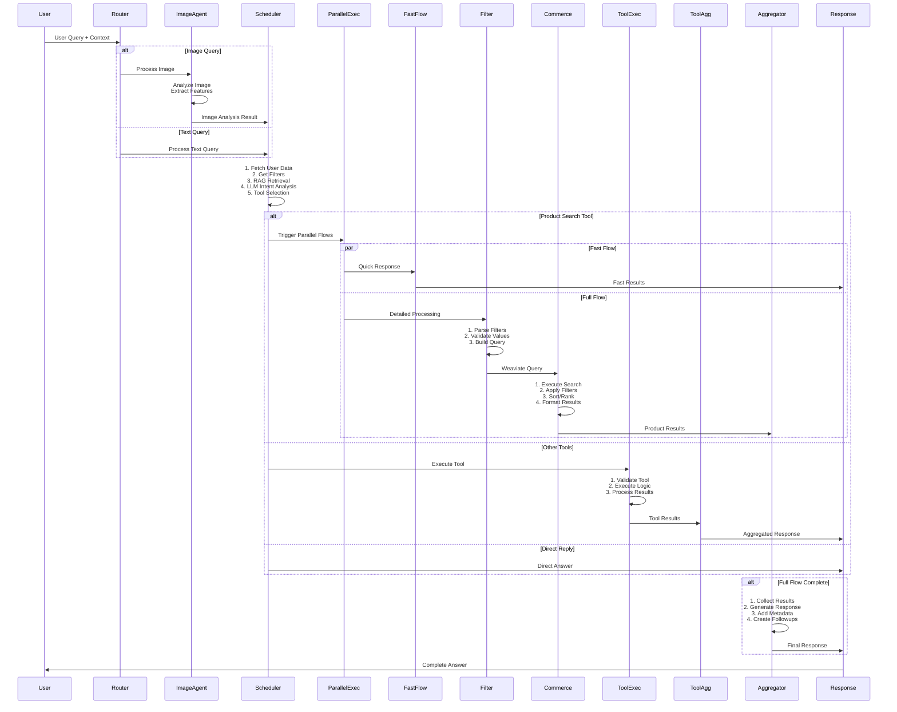
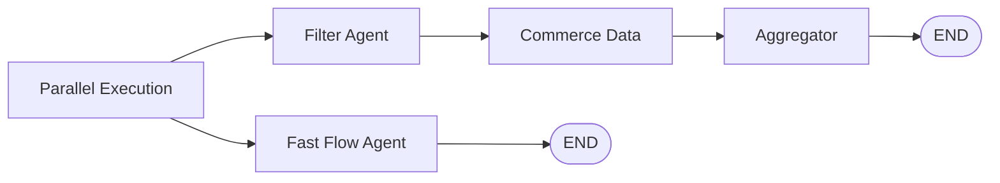
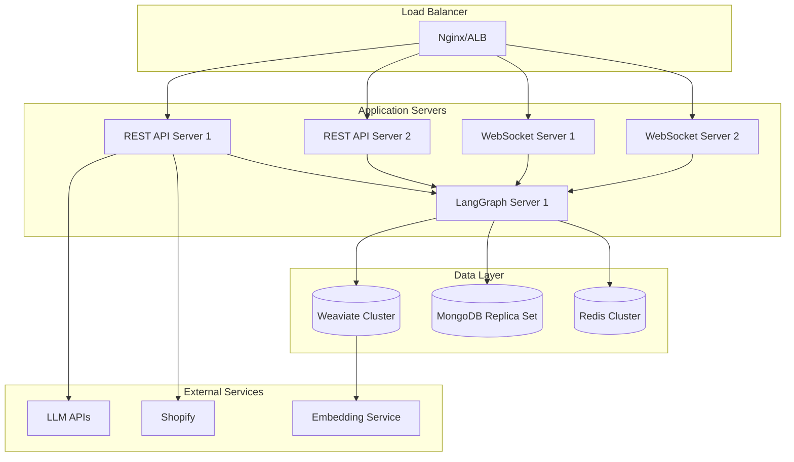

# TrustEngage AI E-commerce Agent - Complete Architecture Documentation

## Table of Contents
1. [Overview](#overview)
2. [System Architecture](#system-architecture)
3. [Agent Flow Diagram](#agent-flow-diagram)
4. [Core Components](#core-components)
5. [Agent Nodes Detailed](#agent-nodes-detailed)
6. [State Management](#state-management)
7. [Tools & Capabilities](#tools--capabilities)
8. [Data Flow](#data-flow)
9. [Infrastructure](#infrastructure)
10. [API Endpoints](#api-endpoints)
11. [Technology Stack](#technology-stack)

---

## Overview

TrustEngage is an intelligent AI-powered e-commerce assistant that provides personalized shopping experiences through natural language conversations. The system uses LangGraph for orchestrating multiple specialized agents, each handling specific aspects of the shopping journey.

### Key Features
- **Multi-Agent Architecture**: Specialized agents for routing, image processing, filtering, commerce data, and response aggregation
- **Personalized Recommendations**: Context-aware product suggestions based on user preferences and history
- **Natural Language Processing**: Intent analysis and query understanding
- **Real-time Communication**: WebSocket support for instant responses
- **Parallel Processing**: Fast and full flow execution for optimal performance
- **RAG Integration**: Retrieval-Augmented Generation for contextual responses
- **State Persistence**: Redis-based state management for conversation continuity

---

## System Architecture



---

## Agent Flow Diagram

### Complete Query Processing Flow



---

## Core Components

### 1. API Layer

#### a) WebSocket API (`websocket_api.py`)
- **Purpose**: Real-time bidirectional communication
- **Port**: Configurable (default: 8001)
- **Features**:
  - Connection management
  - Session handling
  - Real-time message streaming
  - Error handling and reconnection

#### b) REST API (`api.py`)
- **Purpose**: HTTP-based interactions
- **Port**: Configurable (default: 8000)
- **Features**:
  - RESTful endpoints
  - Authentication middleware
  - Request validation
  - Prometheus metrics

#### c) LangGraph API (`langgraph_api.py`)
- **Purpose**: Direct graph invocation
- **Features**:
  - Graph execution endpoints
  - State inspection
  - Debug capabilities

### 2. Agent Graph (`graph.py`)

The core orchestration engine built on LangGraph that coordinates all agent nodes.

**Key Features**:
- **State Management**: Redis-backed persistent state
- **Node Routing**: Conditional edges based on agent decisions
- **Parallel Execution**: Concurrent processing of independent tasks
- **Error Recovery**: Graceful handling of node failures

**Graph Configuration**:
```python
workflow = RedisStateGraph(
    AgentState,
    redis_host=REDIS_HOST,
    redis_port=REDIS_PORT,
    redis_db=REDIS_DB,
    session_ttl=SESSION_TTL
)
```

### 3. State Management (`state.py`)

The `AgentState` TypedDict defines the complete state schema:

```python
class AgentState(TypedDict):
    # User Context
    user_query: str
    refined_query: str
    user_id: str
    sessionId: str
    conversation_id: str
    
    # Query Processing
    intent: str
    reasoning: str
    image_urls: Optional[List[str]]
    
    # Filter & Search
    existing_filters: List[Dict[str, str]]
    hard_filters: List[Filter]
    soft_filters: str
    sorting_criteria: Dict[str, str]
    strict_search: bool
    
    # Tools & Actions
    tool_name: List
    tool_args: List[Dict[str, str]]
    tool_response: str
    
    # Results & Response
    commerce_response: str
    reply: str
    suggested_answers: List[str]
    
    # Product Context
    product_ids: List[int]
    product_variant_ids: List[str]
    additional_ids: List[str]
    
    # Conversation Flow
    history: List[str]
    rag_response: str
    next_agent: str
    end_conversation: bool
    followup_processing: str
    agent_initiation_id: str
```

---

## Agent Nodes Detailed

### 1. Router Agent

**File**: `graph.py` - `router_agent()`

**Purpose**: Initial request routing and flow determination

**Logic**:
```python
def router_agent(state: Dict) -> Dict:
    next_agent = "scheduler_agent"
    if state.get("image_urls") is not None:
        next_agent = "image_agent"
    return {**state, "next_agent": next_agent}
```

**Decision Criteria**:
- Presence of image URLs → Image Agent
- Text-only query → Scheduler Agent
- Direct commands → Direct Reply Agent

**Performance**: < 1ms (simple routing logic)

---

### 2. Image Agent

**File**: `nodes/image_node.py`

**Purpose**: Process image-based queries for visual search

**Process Flow**:
1. **Image Download & Validation**
   - Fetch images from URLs
   - Validate image format and size
   - Extract metadata

2. **Feature Extraction**
   - Visual feature analysis
   - Color detection
   - Style identification
   - Category classification

3. **Search Parameter Generation**
   - Convert visual features to search filters
   - Generate semantic query
   - Prepare filter conditions

4. **Integration with Scheduler**
   - Pass enriched query to Scheduler Agent
   - Maintain conversation context

**Technologies**:
- Vision LLM (GPT-4 Vision / Claude 3 Sonnet)
- Image preprocessing libraries
- Weaviate vector search

**Example Output**:
```json
{
    "refined_query": "Blue denim jacket with vintage wash",
    "filters": ["category:Jackets", "color:Blue", "style:Vintage"],
    "next_agent": "scheduler_agent"
}
```

---

### 3. Scheduler Agent

**File**: `nodes/scheduler_node.py`

**Purpose**: Central orchestrator for intent analysis and tool selection

**Detailed Process**:

#### Phase 1: Context Building (Parallel Execution)
```python
with concurrent.futures.ThreadPoolExecutor(max_workers=5) as executor:
    futures = {
        executor.submit(get_user_data, user_id): "user_data",
        executor.submit(get_filters): "filters",
        executor.submit(get_client_preferences): "preferences",
        executor.submit(get_rag_data, query): "rag_data",
        executor.submit(build_current_context, history): "context"
    }
```

**Fetched Data**:
- User preferences and history
- Available filters (categories, brands, colors, etc.)
- RAG knowledge base data
- Client-specific configurations
- Conversation context

#### Phase 2: LLM Intent Analysis

**System Prompt Structure**:
```
You are an intelligent e-commerce assistant.
Context:
- Available filters: {filters}
- User preferences: {user_data}
- RAG knowledge: {rag_context}
- Brand voice: {brand_voice}

Analyze the user query and select the appropriate tool.
```

**Tool Selection Criteria**:
- `search_products`: Product search queries
- `get_cart_details`: Cart-related queries
- `checkout`: Purchase intent
- `get_recommendations`: Generic recommendations
- `provide_conversational_response`: Informational queries

#### Phase 3: Routing Decision

```python
def route_after_scheduler_agent(state: Dict) -> str:
    if should_end_conversation(state):
        return "direct_reply_agent"
    
    tool_name = state.get("tool_name", "")
    if tool_name == "search_products":
        return "parallel_execution"
    else:
        return "tool_execution_agent"
```

**Performance Metrics**:
- Average latency: 800-1200ms
- LLM call time: 600-900ms
- Context building: 200-400ms

---

### 4. Parallel Execution Node

**File**: `graph.py` - `parallel_execution_node()`

**Purpose**: Trigger both fast and full flow simultaneously

**Architecture**:


**Benefits**:
- **Fast Flow**: Quick preliminary results (500-800ms)
- **Full Flow**: Comprehensive, filtered results (1500-2500ms)
- **User Experience**: Progressive loading

---

### 5. Fast Flow Agent

**File**: `nodes/fast_flow_node.py`

**Purpose**: Provide quick initial results using semantic search

**Process**:
1. **Quick Semantic Search**
   - Direct Weaviate vector search
   - No complex filtering
   - Top 5-10 results

2. **Basic Formatting**
   - Minimal product details
   - Essential metadata only

3. **Immediate Response**
   - Stream to client
   - Display while full flow processes

**Query Example**:
```python
collection.query.near_text(
    query=refined_query,
    limit=10,
    return_properties=["id", "title", "price", "image"]
)
```

**Performance**: 500-800ms average

---

### 6. Filter Agent

**File**: `nodes/filter_node.py`

**Purpose**: Process and validate filter requirements

**Detailed Process**:

#### Step 1: Filter Extraction
```python
parsed_filters = state.get("tool_args", [{}])[0].get("filters", [])
reasoning = state.get("tool_args", [{}])[0].get("reasoning", {})
```

**Filter Types**:
- **Categorical**: Categories, brands, tags
- **Numerical**: Price ranges, ratings
- **Boolean**: In stock, on sale
- **Hierarchical**: Category trees

#### Step 2: Parallel Filter Value Fetching
```python
def fetch_filter_values_parallel(parsed_filters, max_workers=10):
    with ThreadPoolExecutor(max_workers=max_workers) as executor:
        futures = {
            executor.submit(get_filter_values, filter_name): filter_name
            for filter_name in parsed_filters
        }
```

**Cached Data**:
- Filter values cached for 1 hour
- Category tree cached for 24 hours
- Brand lists cached for 6 hours

#### Step 3: Filter Validation

**Validation Rules**:
- Check filter value existence
- Validate filter combinations
- Apply category tree logic
- Handle conflicts (e.g., mutually exclusive filters)

**Example Validation**:
```python
if "category" in filters and "sub_category" in filters:
    # Ensure sub_category is child of category
    if not is_valid_category_hierarchy(category, sub_category):
        remove_conflict(sub_category)
```

#### Step 4: Weaviate Query Construction

**Query Structure**:
```python
hard_filters = []
for filter_name, filter_value in validated_filters:
    hard_filters.append(
        Filter.by_property(filter_name).equal(filter_value)
    )

query = {
    "filters": hard_filters,
    "soft_filters": refined_query,
    "limit": 50,
    "sort": sorting_criteria
}
```

**Filter Types in Weaviate**:
- **Hard Filters**: Exact matching (category, brand)
- **Soft Filters**: Semantic matching (query text)
- **Hybrid**: Combination of both

**Performance**: 400-700ms average

---

### 7. Commerce Data Agent

**File**: `nodes/commerce_data_node.py`

**Purpose**: Execute product search and retrieve results from Weaviate

**Detailed Process**:

#### Step 1: Query Configuration
```python
search_config = {
    "collection_name": "Products",
    "query_text": soft_filters,
    "hard_filters": hard_filters,
    "limit": 50,
    "sort_by": sorting_criteria,
    "search_type": "hybrid"  # soft + hard
}
```

**Search Types**:
1. **Soft Search**: Semantic vector search only
2. **Hard Search**: Filter-based only
3. **Hybrid Search**: Combined approach (default)

#### Step 2: Weaviate Execution

**Vector Search**:
```python
result = collection.query.hybrid(
    query=query_text,
    where=hard_filters,
    limit=limit,
    alpha=0.5,  # Balance between BM25 and vector
    return_properties=[
        "id", "title", "description", "price", 
        "images", "variants", "brand", "category",
        "rating", "reviews_count", "in_stock"
    ]
)
```

**Ranking Algorithm**:
- Vector similarity: 50%
- BM25 keyword match: 30%
- Popularity score: 10%
- Recency: 5%
- Availability: 5%

#### Step 3: Result Processing

**Processing Steps**:
1. **Deduplication**
   - Remove duplicate product IDs
   - Keep highest-ranked variant

2. **Availability Filtering**
   - Check stock status
   - Validate variant availability

3. **Enrichment**
   - Add discount information
   - Calculate savings
   - Add user-specific data (saved, in cart)

4. **Sorting**
   - Apply sorting criteria
   - Re-rank if needed
   - Limit results

**Example Result**:
```json
{
    "products": [
        {
            "id": "12345",
            "title": "Blue Denim Jacket",
            "price": 89.99,
            "compare_at_price": 120.00,
            "discount_percent": 25,
            "images": ["url1", "url2"],
            "in_stock": true,
            "rating": 4.5,
            "reviews_count": 234,
            "is_saved": false,
            "is_in_cart": false
        }
    ],
    "total_count": 45,
    "applied_filters": {...}
}
```

**Performance**: 600-1000ms average

---

### 8. Tool Execution Agent

**File**: `nodes/tool_execution_node.py`

**Purpose**: Execute non-product-search tools

**Supported Tools**:

#### Cart Operations
- `get_cart_details`: Retrieve cart contents
- `bulk_add_update_cart`: Add/update multiple items
- `checkout`: Create order

#### User Collections
- `get_user_saved_collection`: Get saved products
- `add_to_saved_collection`: Save products
- `get_recently_viewed_items`: View history

#### Product Intelligence
- `get_similar_products`: Find similar items
- `get_complementary_products`: Cross-sell suggestions
- `get_frequently_bought_together`: Bundle suggestions

#### Recommendations
- `get_recommendations_wrapper`: Personalized picks
- `get_trending_category_products`: Trending items
- `get_top_rated_category_products`: Top rated

#### Q&A
- `ask_product_question`: Submit question
- `answer_product_question`: Submit answer

**Execution Flow**:
```python
def execute_tool(tool_name, tool_args):
    try:
        # 1. Validate tool exists
        tool_func = TOOL_REGISTRY.get(tool_name)
        
        # 2. Validate arguments
        validate_tool_args(tool_name, tool_args)
        
        # 3. Execute with timeout
        with timeout(30):
            result = tool_func(**tool_args)
        
        # 4. Format result
        return format_tool_result(result)
        
    except TimeoutError:
        return error_response("Tool execution timeout")
    except Exception as e:
        return error_response(f"Tool error: {str(e)}")
```

**Performance**: 300-1500ms (varies by tool)

---

### 9. Tool Aggregator Agent

**File**: `nodes/tool_aggregator_node.py`

**Purpose**: Aggregate and format tool execution results

**Process**:
1. **Result Collection**
   - Gather tool execution results
   - Validate completeness

2. **Response Generation**
   - Use LLM to generate natural language response
   - Include tool-specific formatting
   - Add relevant metadata

3. **Final Formatting**
   - Structure response for frontend
   - Add action buttons if applicable
   - Include follow-up suggestions

**Example Output**:
```json
{
    "reply": "I've added 2 Blue Denim Jackets to your cart!",
    "tool_response": {
        "cart_items": [...],
        "total": 179.98,
        "items_count": 3
    },
    "suggested_actions": [
        {"type": "view_cart", "label": "View Cart"},
        {"type": "checkout", "label": "Proceed to Checkout"}
    ],
    "suggested_answers": [
        "Show me similar jackets",
        "View my cart",
        "Continue shopping"
    ]
}
```

---

### 10. Aggregator Agent

**File**: `nodes/aggregator_node.py`

**Purpose**: Generate final natural language response with product results

**Detailed Process**:

#### Phase 1: Data Collection & Enrichment
```python
# 1. Extract product IDs
product_ids = extract_product_ids(commerce_response)

# 2. Parallel data fetching
with ThreadPoolExecutor(max_workers=10) as executor:
    futures = {
        executor.submit(get_product_comprehensive_details, pid): pid
        for pid in product_ids
    }
    
    # Also fetch user-specific data
    futures[executor.submit(get_user_saved_collection, user_id)] = "saved"
    futures[executor.submit(get_cart_details, user_id)] = "cart"
```

**Enriched Data**:
- Product details (title, price, images)
- Variant information
- Availability status
- User context (saved, in cart, viewed)
- Discount information
- Rating and reviews

#### Phase 2: Response Generation with LLM

**System Prompt Template** (`aggregator_system_prompt.jinja`):
```jinja
You are a helpful e-commerce assistant for {{ brand_name }}.

Brand Voice: {{ brand_voice }}

User Preferences:
- Style: {{ user_style }}
- Budget: {{ user_budget }}
- Previous purchases: {{ purchase_history }}

Available Products:
{{ products_json }}

User Query: {{ refined_query }}
Filter Applied: {{ applied_filters }}

Generate a helpful, conversational response that:
1. Addresses the user's query naturally
2. Highlights 3-5 most relevant products
3. Explains why these products match their needs
4. Adds personalized recommendations
5. Suggests follow-up actions
```

**User Prompt Template** (`aggregator_user_prompt.jinja`):
```jinja
User asked: "{{ user_query }}"

Search Results: {{ total_count }} products found
Applied Filters: {{ filters_summary }}

Top Products:

- {{ product.title }}: ${{ product.price }}
  Rating: {{ product.rating }}/5 ({{ product.reviews_count }} reviews)
  {{ product.key_features }}


User Context:
- Previously viewed: {{ recently_viewed }}
- Saved items: {{ saved_items }}
- Cart items: {{ cart_items }}

Generate response following brand voice and including:
1. Natural greeting/acknowledgment
2. Product recommendations with reasoning
3. Personalized suggestions
4. Call-to-action
5. Follow-up questions
```

#### Phase 3: Re-ranking with Gemini Reranker

**Optional Enhancement**:
```python
if enable_reranking:
    reranker = GeminiReranker()
    reranked_products = reranker.rerank(
        query=refined_query,
        products=products,
        top_k=10,
        user_context=user_data
    )
```

**Reranking Factors**:
- Query relevance
- User preference alignment
- Popularity
- Availability
- Price match
- Style compatibility

#### Phase 4: Follow-up Generation

**Follow-up Suggestions**:
```python
followups = generate_followup_content(
    products=products,
    filters=applied_filters,
    user_query=refined_query,
    conversation_history=history
)
```

**Types of Follow-ups**:
1. **Filter Refinement**: "Show blue ones only"
2. **Related Searches**: "Similar jackets under $100"
3. **Alternative Categories**: "Show me hoodies instead"
4. **Product Actions**: "Add the first one to cart"

#### Phase 5: Current Filter State

**Generate remaining filter options**:
```python
remaining_filters = generate_current_remaining_filter_values(
    applied_filters=state["existing_filters"],
    search_results=products
)
```

**Output**:
```json
{
    "available_filters": {
        "color": ["Blue", "Black", "Gray"],
        "size": ["S", "M", "L", "XL"],
        "brand": ["Levi's", "GAP", "H&M"],
        "price_range": ["$50-$100", "$100-$150"]
    },
    "applied_filters": {
        "category": "Jackets",
        "style": "Casual"
    }
}
```

#### Final Output Structure

```json
{
    "reply": "I found 45 amazing denim jackets for you! Based on your style, here are my top picks:\n\n1. **Classic Blue Denim Jacket** by Levi's - $89.99\n   Perfect for casual wear with vintage wash\n\n2. **Oversized Denim Jacket** by GAP - $79.99\n   Trending style, comfortable fit\n\n3. **Cropped Denim Jacket** by H&M - $49.99\n   Great for pairing with high-waist jeans\n\nAll are in stock and available in your size!",
    
    "products": [
        {
            "id": "12345",
            "title": "Classic Blue Denim Jacket",
            "price": 89.99,
            "compare_at_price": 120.00,
            "images": ["url1", "url2"],
            "rating": 4.5,
            "reviews_count": 234,
            "in_stock": true,
            "variants": [...],
            "is_saved": false,
            "is_in_cart": false
        }
    ],
    
    "suggested_answers": [
        "Show me more Levi's jackets",
        "Filter by price under $80",
        "Add the first jacket to cart",
        "Show similar jackets"
    ],
    
    "metadata": {
        "total_count": 45,
        "applied_filters": {...},
        "available_filters": {...},
        "search_type": "hybrid",
        "execution_time_ms": 1850
    }
}
```

**Performance**: 1000-1800ms average

---

### 11. Direct Reply Agent

**File**: `graph.py` - `direct_reply_agent()`

**Purpose**: Handle simple conversational responses

**Use Cases**:
- Greetings: "Hello", "Hi"
- Thank you: "Thanks", "Thank you"
- Acknowledgments: "Ok", "Got it"
- Store policies: "What's your return policy?"
- Brand information: "Tell me about your brand"

**Process**:
```python
def direct_reply_agent(state: Dict) -> Dict:
    # State already contains the reply from scheduler
    return state
```

**Performance**: < 50ms (passthrough)

---

## Tools & Capabilities

### Product Search Tool (`search_products`)

**Most Complex and Powerful Tool**

**Input Schema**:
```json
{
    "thinking": {
        "step_1_user_intention": "User wants casual denim jacket for everyday wear",
        "step_2_resolution_logic": "Map to category:Jackets, material:Denim, style:Casual"
    },
    "reasoning": {
        "history_analysis": "User previously viewed hoodies, likes casual style",
        "context_merge_decision": "preserve",
        "merge_keys": "style, budget",
        "overall_logic": "Keep casual style preference, add jacket category"
    },
    "refined_query": "I'm looking for casual denim jackets for everyday wear under $100",
    "filters": ["category", "material", "style", "price_range"]
}
```

**Processing Steps**:
1. Thinking phase validates user intent
2. Reasoning handles conversation context
3. Refined query expands original query
4. Filters mapped to available filter keys

### Complete Tool List

#### 1. Product Discovery
```javascript
search_products(thinking, reasoning, refined_query, filters)
get_similar_products(product_id, reasoning, refined_query)
get_complementary_products(product_id, refined_query)
get_trending_category_products(category, refined_query)
get_top_rated_category_products(category, refined_query)
```

#### 2. Recommendations
```javascript
get_recommendations_wrapper(client_id, user_id)
get_frequently_bought_together_product(product_id, refined_query)
```

#### 3. User Collections
```javascript
get_user_saved_collection(user_id, refined_query)
add_to_saved_collection(user_id, product_ids, refined_query)
get_recently_viewed_items(user_id, refined_query)
```

#### 4. Cart Management
```javascript
get_cart_details(user_id, refined_query, frontend_action)
bulk_add_update_cart(user_id, cart_items, refined_query, frontend_action, quantity)
checkout(user_id, refined_query, frontend_action)
```

#### 5. Orders
```javascript
get_user_placed_orders(user_id, refined_query)
```

#### 6. Community Q&A
```javascript
ask_product_question(product_id, user_id, question, refined_query)
answer_product_question(product_id, user_id, question_id, answer, refined_query)
```

#### 7. Conversational
```javascript
provide_conversational_response(reasoning, response, suggestions)
```

---

## Data Flow

### 1. Request Flow

```
User Input
    ↓
WebSocket/REST API
    ↓
Router Agent
    ↓
[Image Agent (if image)] → Scheduler Agent
    ↓
Intent Analysis + Tool Selection
    ↓
┌─────────────────┬─────────────────────┐
│                 │                     │
Parallel Exec    Tool Exec      Direct Reply
│                 │                     │
├─ Fast Flow      │                     │
│                 │                     │
└─ Filter →      Tool Aggregator       │
   Commerce →                           │
   Aggregator                           │
        │                │              │
        └────────────────┴──────────────┘
                    ↓
            Final Response
                    ↓
            User Interface
```

### 2. Data Sources

#### Weaviate Vector Database
- **Collections**:
  - Products (main collection)
  - Categories
  - Content pages
  - FAQ documents

**Product Schema**:
```python
{
    "id": "integer",
    "title": "text",
    "description": "text",
    "price": "number",
    "compare_at_price": "number",
    "images": "text[]",
    "brand": "text",
    "category": "text",
    "sub_category": "text",
    "tags": "text[]",
    "color": "text[]",
    "size": "text[]",
    "material": "text",
    "style": "text",
    "in_stock": "boolean",
    "rating": "number",
    "reviews_count": "number",
    "created_at": "date",
    "variants": "object[]",
    "metadata": "object"
}
```

#### MongoDB Collections
- **users**: User profiles and preferences
- **sessions**: User sessions
- **carts**: Shopping carts
- **orders**: Order history
- **saved_collections**: User saved items
- **user_events**: User interaction events
- **product_questions**: Community Q&A
- **product_reviews**: Product reviews
- **engagement_rules**: Proactive engagement rules
- **brand_configurations**: Client configurations

#### Redis Cache
- **State Management**: Conversation state
- **Filter Cache**: Available filter values (TTL: 1 hour)
- **Category Cache**: Category tree (TTL: 24 hours)
- **Session Data**: User session info (TTL: 30 minutes)
- **Rate Limiting**: API rate limits

---

## Infrastructure

### 1. Deployment Architecture



### 2. Service Components

#### a) REST API Service
- **File**: `ai_agent/api.py`
- **Port**: 8000
- **Framework**: FastAPI
- **Purpose**: HTTP endpoints
- **Scaling**: Horizontal (stateless)

#### b) WebSocket Service
- **File**: `ai_agent/websocket_api.py`
- **Port**: 8001
- **Framework**: FastAPI WebSocket
- **Purpose**: Real-time communication
- **Scaling**: Horizontal with sticky sessions

#### c) LangGraph Service  
- **File**: `ai_agent/langgraph_api.py`
- **Port**: 8002
- **Framework**: LangGraph Server
- **Purpose**: Graph execution
- **Scaling**: Horizontal (stateless)

#### d) Analytics Service
- **Directory**: `analytics_server/`
- **Purpose**: Event processing and analytics
- **Components**:
  - User analytics
  - Intent tracking
  - Performance metrics

#### e) Onboarding Service
- **Directory**: `onboarding_server/`
- **Purpose**: Client onboarding and data ingestion
- **Features**:
  - Product catalog ingestion
  - Weaviate vectorization
  - Configuration setup

### 3. Monitoring & Observability

#### Prometheus Metrics
```python
from prometheus_client import Counter, Histogram

# Request metrics
requests_total = Counter('requests_total', 'Total requests', ['endpoint'])
request_duration = Histogram('request_duration_seconds', 'Request duration')

# Agent metrics
agent_executions = Counter('agent_executions_total', 'Agent executions', ['agent_name'])
agent_errors = Counter('agent_errors_total', 'Agent errors', ['agent_name'])

# LLM metrics
llm_calls = Counter('llm_calls_total', 'LLM API calls', ['model'])
llm_tokens = Counter('llm_tokens_total', 'LLM tokens used', ['model', 'type'])
```

#### Logging
```python
from library.logger import get_logger

logger = get_logger()

# Structured logging
logger.info(
    "Agent executed",
    extra={
        "agent_name": "scheduler",
        "user_id": user_id,
        "session_id": session_id,
        "execution_time_ms": 850,
        "tool_selected": "search_products"
    }
)
```

### 4. Configuration Management

#### Environment Variables
```bash
# Server
SERVER_ENVIRONMENT=PRODUCTION
API_PORT=8000
WEBSOCKET_PORT=8001

# Database
MONGODB_URI=mongodb://...
REDIS_HOST=localhost
REDIS_PORT=6379
WEAVIATE_URL=http://localhost:8080

# LLM Providers
OPENAI_API_KEY=sk-...
ANTHROPIC_API_KEY=...
GOOGLE_API_KEY=...

# Shopify
SHOPIFY_ACCESS_TOKEN=...
SHOPIFY_STORE_URL=...

# Config
SESSION_TTL=3600
RATE_LIMIT_PER_MINUTE=60
```

#### LLM Configuration (`config/llm_config.py`)
```python
LLM_CONFIG = {
    "image_agent": {
        "model_name": "gpt-4-vision-preview",
        "temperature": 0.3,
        "max_tokens": 1000
    },
    "scheduler_agent": {
        "model_name": "gpt-4o-mini",
        "temperature": 0.5,
        "max_tokens": 2000
    },
    "filter_agent": {
        "model_name": "gpt-4o-mini",
        "temperature": 0.3,
        "max_tokens": 1500
    },
    "aggregator_agent": {
        "model_name": "gpt-4o",
        "temperature": 0.7,
        "max_tokens": 2000
    }
}
```

---

## API Endpoints

### REST API Endpoints

#### Product Endpoints
```
GET    /products/{product_id}                  # Get product details
GET    /products/search                        # Search products
GET    /products/{product_id}/similar          # Get similar products
GET    /products/{product_id}/complementary    # Get complementary products
POST   /products/{product_id}/question         # Ask question
POST   /products/{product_id}/review           # Add review
```

#### User Endpoints
```
GET    /user/saved-collection                  # Get saved items
POST   /user/saved-collection                  # Add to saved
DELETE /user/saved-collection/{product_id}     # Remove from saved
GET    /user/recently-viewed                   # Get recently viewed
GET    /user/recommendations                   # Get recommendations
```

#### Cart Endpoints
```
GET    /cart                                   # Get cart details
POST   /cart/add                               # Add to cart
PUT    /cart/update                            # Update cart
DELETE /cart/remove/{variant_id}               # Remove from cart
POST   /cart/checkout                          # Checkout
```

#### Order Endpoints
```
GET    /orders                                 # Get user orders
GET    /orders/{order_id}                      # Get order details
```

#### Catalog Endpoints
```
GET    /catalog/filters                        # Get available filters
GET    /catalog/categories                     # Get category tree
GET    /catalog/trending                       # Get trending products
GET    /catalog/top-rated                      # Get top rated products
```

### WebSocket Events

#### Client → Server
```javascript
// Connect
{
    "type": "connect",
    "client_id": "12345",
    "user_id": "67890",
    "session_id": "abc123"
}

// Send message
{
    "type": "message",
    "query": "Show me blue denim jackets",
    "session_id": "abc123",
    "context": {
        "page": "product_listing",
        "applied_filters": {...}
    }
}

// Update context
{
    "type": "context_update",
    "session_id": "abc123",
    "context": {...}
}
```

#### Server → Client
```javascript
// Agent response
{
    "type": "agent_response",
    "session_id": "abc123",
    "reply": "I found 45 amazing denim jackets...",
    "products": [...],
    "suggested_answers": [...],
    "metadata": {...}
}

// Streaming response (progressive)
{
    "type": "stream_chunk",
    "session_id": "abc123",
    "chunk": "I found 45",
    "chunk_index": 0
}

// Error
{
    "type": "error",
    "session_id": "abc123",
    "error": "Rate limit exceeded",
    "code": "RATE_LIMIT"
}
```

---

## Technology Stack

### Core Technologies

#### Backend Framework
- **FastAPI**: REST API and WebSocket server
- **Python 3.12**: Programming language
- **Uvicorn**: ASGI server

#### Agent Orchestration
- **LangGraph**: Agent workflow orchestration
- **LangChain**: LLM integration utilities

#### LLM Providers
- **OpenAI**: GPT-4, GPT-4o, GPT-4o-mini
- **Anthropic**: Claude 3.5 Sonnet, Claude 3 Opus
- **Google**: Gemini 1.5 Pro, Gemini 1.5 Flash
- **Vertex AI**: Enterprise LLM access

#### Vector Database
- **Weaviate**: Vector search and storage
- **Version**: 1.28.4
- **Features**: Hybrid search, multi-tenancy, graphQL

#### Databases
- **MongoDB**: Document store for user data
- **Redis**: Cache and state management
- **PostgreSQL**: (Optional) Analytics data

#### Embedding Models
- **OpenAI Ada 002**: General embeddings
- **Ollama Nomic Embed**: Local embeddings
- **Custom Fine-tuned**: Domain-specific embeddings

#### E-commerce Integration
- **Shopify**: E-commerce platform
- **Shopify Storefront API**: Headless commerce
- **Shopify Admin API**: Catalog management

### Infrastructure

#### Containerization
- **Docker**: Container runtime
- **Docker Compose**: Local orchestration

#### Service Deployment Files
```yaml
# setup/deployment/
- trustengage-api.service
- trustengage-websocket.service
- trustengage-langgraph.service
- trustengage-oneclick.service
- trustengage-analytics.service
```

#### Monitoring
- **Prometheus**: Metrics collection
- **Grafana**: Metrics visualization
- **Langfuse**: LLM observability
- **Custom Logging**: Structured logging

#### CI/CD
- **GitHub Actions**: Automation
- **Pre-commit Hooks**: Code quality
- **Black**: Code formatting

---

## Performance Benchmarks

### Latency Breakdown

#### Complete Query Flow (Average)
```
Router Agent:                    < 1ms
Image Agent (if applicable):     800-1500ms
Scheduler Agent:                 800-1200ms
  - Context Building:            200-400ms
  - LLM Call:                    600-900ms
Filter Agent:                    400-700ms
  - Filter Validation:           100-200ms
  - Query Construction:          100-150ms
Commerce Agent:                  600-1000ms
  - Weaviate Search:             400-700ms
  - Result Processing:           200-300ms
Aggregator Agent:                1000-1800ms
  - Data Enrichment:             300-500ms
  - LLM Response:                700-1300ms

Total (Product Search):          2500-4000ms
Total (Fast Flow):               500-800ms
```

### Throughput
- **REST API**: ~500 requests/second
- **WebSocket**: ~200 concurrent connections per server
- **Graph Execution**: ~100 executions/second

### Resource Usage
- **CPU**: 2-4 cores per service
- **Memory**: 4-8 GB per service
- **Network**: 10-50 Mbps per server

---

## Security Considerations

### 1. Authentication & Authorization
```python
@app.middleware("http")
async def mongo_config_middleware(request: Request, call_next):
    # Get client configuration
    origin = request.headers.get("origin")
    config = get_client_configuration(origin)
    
    # Validate JWT token
    token = request.headers.get("Authorization")
    user = verify_jwt(token)
    
    # Store in thread-local
    shared_thread.set("user_id", user.id)
    shared_thread.set("client_id", config.client_id)
    
    response = await call_next(request)
    return response
```

### 2. Data Protection
- **PII Encryption**: User data encrypted at rest
- **Secure Communication**: TLS 1.3 for all connections
- **API Key Rotation**: Monthly rotation of LLM API keys
- **Input Sanitization**: All user inputs sanitized

### 3. Rate Limiting
```python
from ai_agent.src.infrastructure.rate_limit_manager import RateLimitManager

rate_limiter = RateLimitManager()

@app.post("/query")
async def query_endpoint(request: Request):
    user_id = request.state.user_id
    
    if not rate_limiter.check_limit(user_id):
        raise HTTPException(429, "Rate limit exceeded")
    
    # Process request
```

### 4. Error Handling
- **No Sensitive Data in Errors**: Generic error messages
- **Logging**: Errors logged without PII
- **Graceful Degradation**: Fallback responses

---

## Future Enhancements

### 1. Multi-Modal Expansion
- Voice input/output
- Video product demos
- AR/VR integration

### 2. Advanced Personalization
- Deep learning recommendation models
- Real-time preference learning
- Cross-session personalization

### 3. Proactive Engagement
- Smart notifications
- Abandoned cart recovery
- Price drop alerts
- Restock notifications

### 4. Analytics & Insights
- Conversation analytics
- Product performance insights
- User behavior patterns
- A/B testing framework

### 5. Integration Expansion
- More e-commerce platforms (WooCommerce, Magento)
- CRM integrations
- Email marketing tools
- Social commerce

---

## Appendix

### A. File Structure
```
trustengage-agent/
├── ai_agent/
│   ├── api.py                      # REST API
│   ├── websocket_api.py            # WebSocket API
│   ├── langgraph_api.py            # LangGraph API
│   ├── routes/
│   │   ├── core_routes.py          # Core endpoints
│   │   ├── webhook_routes.py       # Webhook handlers
│   │   └── websocket_routes.py     # WebSocket handlers
│   └── src/
│       ├── graph/
│       │   ├── graph.py            # Graph definition
│       │   └── state.py            # State schema
│       ├── nodes/
│       │   ├── image_node.py       # Image agent
│       │   ├── scheduler_node.py   # Scheduler agent
│       │   ├── filter_node.py      # Filter agent
│       │   ├── commerce_data_node.py # Commerce agent
│       │   ├── aggregator_node.py  # Aggregator agent
│       │   ├── tool_execution_node.py # Tool execution
│       │   ├── tool_aggregator_node.py # Tool aggregator
│       │   └── fast_flow_node.py   # Fast flow agent
│       ├── access/
│       │   ├── brand.py            # Brand operations
│       │   ├── catalog.py          # Catalog operations
│       │   ├── product.py          # Product operations
│       │   ├── user.py             # User operations
│       │   └── session.py          # Session operations
│       ├── commons/
│       │   ├── llm/
│       │   │   └── llm_classes.py  # LLM wrappers
│       │   ├── rag/
│       │   │   └── retrieve_rag_data.py # RAG retrieval
│       │   ├── redis/
│       │   │   └── redis_state_manager.py # Redis state
│       │   ├── weavite/
│       │   │   └── weavite_query.py # Weaviate queries
│       │   └── helpers/
│       │       ├── filter_validation_helpers.py
│       │       ├── llm_context_helpers.py
│       │       ├── user_personalization.py
│       │       └── brandvoice.py
│       ├── templates/
│       │   ├── scheduler_system_prompt.txt
│       │   ├── scheduler_user_prompt.txt
│       │   ├── filter_system_prompt.jinja
│       │   ├── aggregator_system_prompt.jinja
│       │   └── ...
│       ├── config/
│       │   └── llm_config.py       # LLM configurations
│       └── utils/
│           ├── available_tools.json # Tool definitions
│           └── gemini_reranker.py  # Reranking
├── library/
│   ├── logger.py                   # Logging utilities
│   ├── helper.py                   # Helper functions
│   ├── thread_shared_storage.py    # Thread-local storage
│   └── agent_events.py             # Event tracking
├── analytics_server/               # Analytics service
├── onboarding_server/              # Onboarding service
├── pipelines/                      # Data pipelines
└── setup/                          # Deployment configs
```

### B. Environment Setup

**Prerequisites**:
- Python 3.12+
- Docker & Docker Compose
- MongoDB
- Redis
- Weaviate

**Installation**:
```bash
# Clone repository
git clone https://github.com/trustengage/trustengage-agent.git
cd trustengage-agent

# Create virtual environment
python3 -m venv venv
source venv/bin/activate

# Install dependencies
pip install -r requirements.txt

# Setup environment
cp env.example .env
# Edit .env with your configurations

# Start services
docker-compose up -d

# Run API server
python -m ai_agent.api

# Run WebSocket server
python -m ai_agent.websocket_api
```

### C. Testing

**Run tests**:
```bash
pytest tests/

# Specific test
pytest tests/test_scheduler_node.py

# With coverage
pytest --cov=ai_agent tests/
```

### D. Contributing

**Code Style**:
- Follow PEP 8
- Use Black for formatting
- Type hints required
- Docstrings for all functions

**PR Process**:
1. Create feature branch
2. Make changes
3. Run tests
4. Format with Black
5. Submit PR

---

## Contact & Support

**Documentation**: https://docs.katalyse.ai  
**GitHub**: https://github.com/trustengage/trustengage-agent  
**Email**: support@katalyse.ai

---

**Document Version**: 1.0  
**Last Updated**: 2025-10-25  
**Author**: TrustEngage Team

