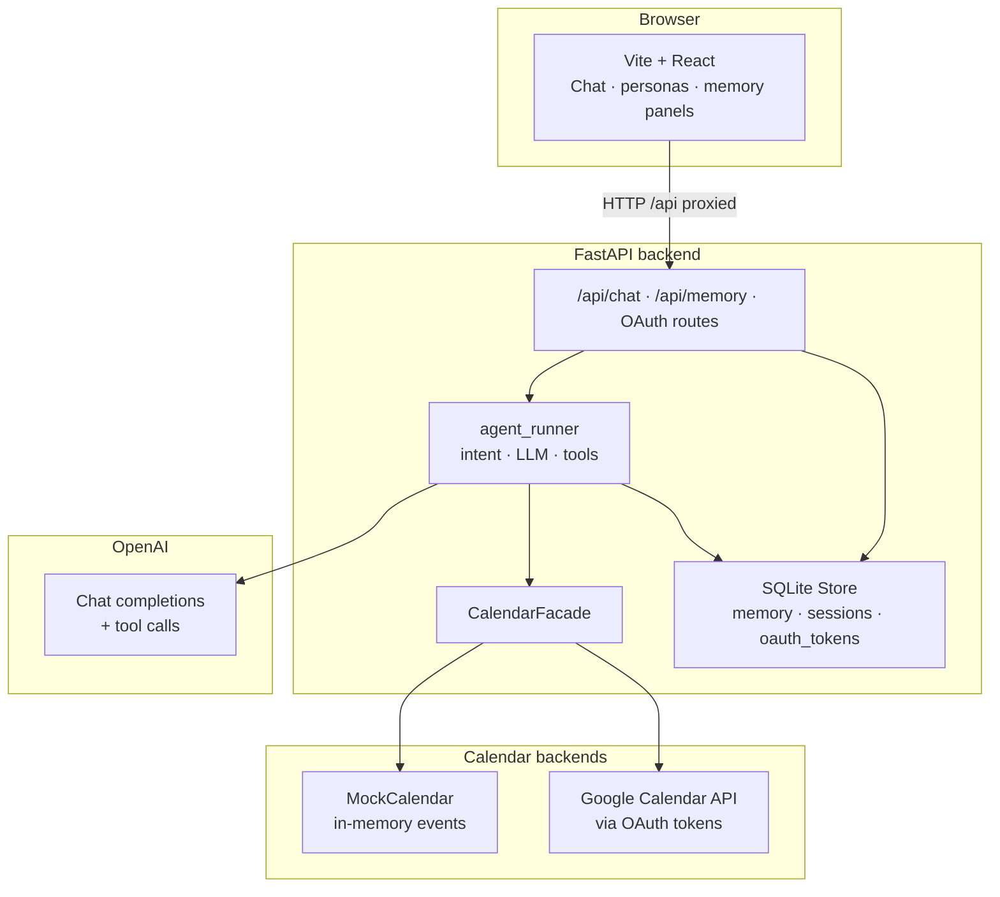
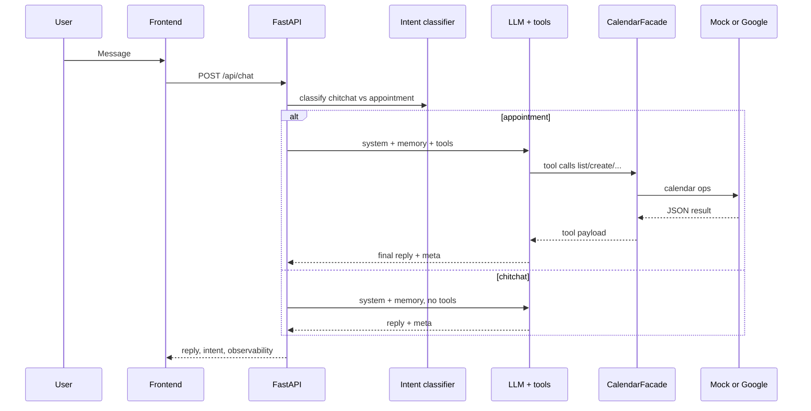
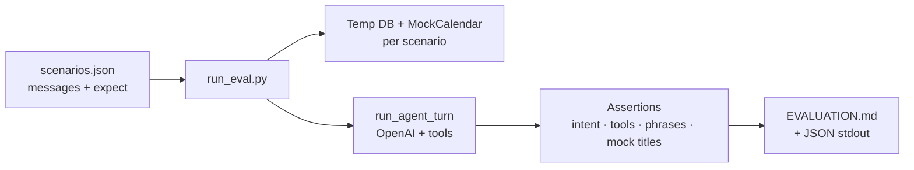
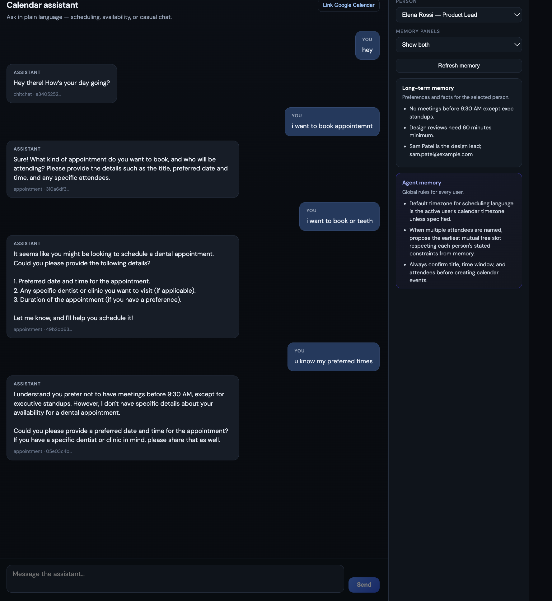
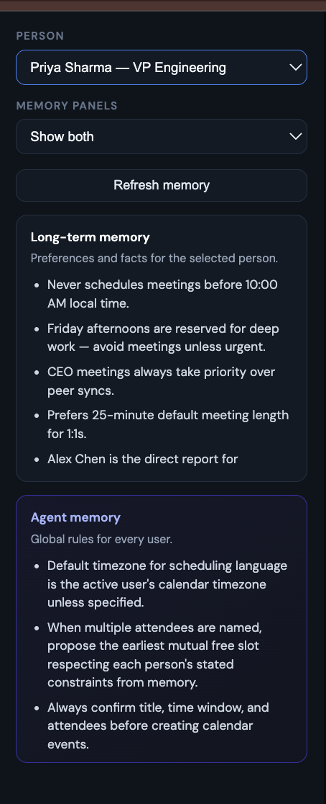
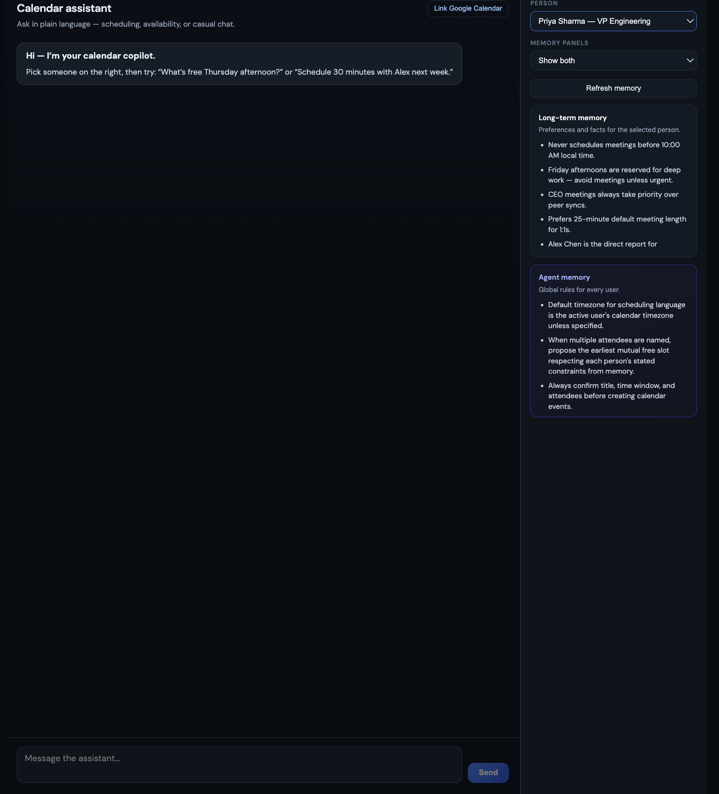
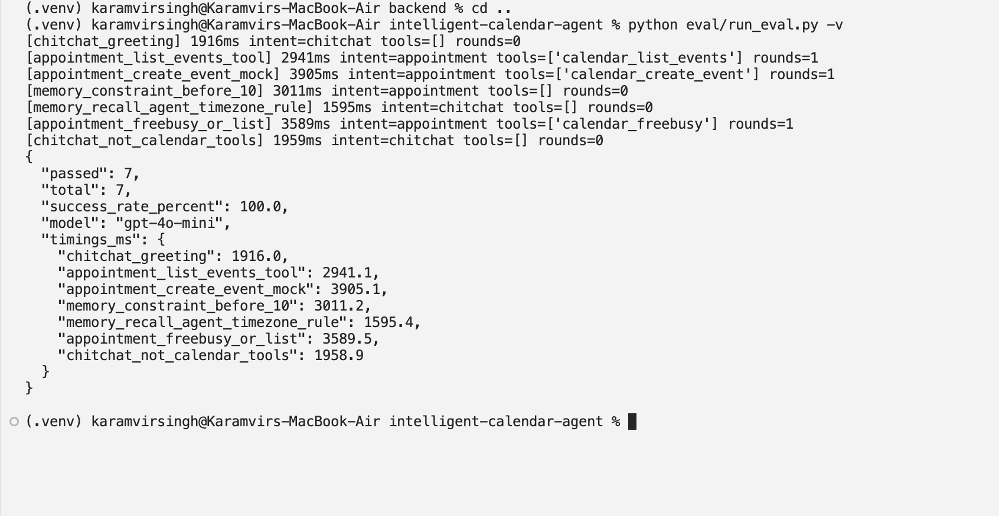

# Intelligent Calendar Agent (MVP)

An **AI executive-assistant** slice for scheduling: it respects **long-term rules** (e.g. no meetings before 10:00, deep-work blocks, priority of exec vs peer), not only empty slots. Integrates with **Google Calendar** (or an in-memory **mock**), keeps **persistent memory** per persona, and ships with an **automated evaluation** suite.

---

## Table of contents

1. [Features & scope](#features--scope)  
2. [Runtime architecture](#runtime-architecture)  
3. [Evaluation architecture](#evaluation-architecture)  
4. [Screenshots (demo)](#screenshots-demo)  
5. [Repository layout](#repository-layout)  
6. [Quickstart](#quickstart)  
7. [Trade-offs](#trade-offs)  
8. [Future enhancements](#future-enhancements)  

---

## Features & scope

| Area | What you get |
|------|----------------|
| **Calendar** | List, create, update, delete, free/busy via tools; **mock** by default, **Google** when OAuth + `MOCK_CALENDAR_DEFAULT=false`. |
| **Memory** | SQLite-backed **user** + **global agent** strings; seeded from `backend/data/personas.json`; optional idle-time consolidation. |
| **Intent** | `chitchat` vs `appointment` so tools attach only when scheduling is relevant. |
| **Auth** | OAuth 2.0 (Web client) with backend callback URI; tokens in SQLite. |
| **Observability** | Structured logs (`req_id`, intent, tool summaries); API can return tool traces. |
| **QA** | `eval/scenarios.json` + `eval/run_eval.py` → success rate + **`EVALUATION.md`**. |

**Out of scope (MVP):** Microsoft Outlook / Graph; org-wide multi-calendar free-busy across other tenants; full SaaS multi-tenant auth. Personas share one Google calendar when live OAuth is enabled (`persona_id` on events for traceability).

---

## Runtime architecture

### Component diagram



### Request path (one chat turn)



**Key files:** `backend/app/main.py` (HTTP), `agent_runner.py` (intent + tool loop), `calendar_facade.py` (routing), `calendar_mock.py` / `calendar_google.py`, `store.py`, `config.py`.

---

## Evaluation architecture

Offline runs use the **same agent code** as production, with an **isolated SQLite file** and **fresh `MockCalendar` per scenario** (no network to Google unless you change that).



**What gets checked**

| Check | Meaning |
|-------|--------|
| `intent` / `intent_one_of` | Matches routing label from the classifier. |
| `tool_names_all` / `tool_names_one_of` | Tools actually recorded in `decision_log` (flow correctness). |
| `tool_rounds_min` / `max` | How many tool rounds executed. |
| `reply_contains_any` / `all` | Substrings in the assistant reply (OR vs AND). |
| `mock_event_title_contains` | Mock calendar state after the turn. |

**Run:** from repo root, `python eval/run_eval.py` (reads `backend/.env` for `OPENAI_API_KEY`). Flags: `--list`, `-v`, `--scenario <id>`.

---

## Screenshots (demo)

### Natural-language scheduling (chat)



### Personas and memory panels



### Google Calendar link (OAuth)



### Rule adherence (memory constraint)


### Automated evaluation (success rate)



---

## Repository layout

```
intelligent-calendar-agent/
├── backend/app/          # FastAPI, agent, facade, OAuth, store
├── backend/data/         # personas.json seeds
├── frontend/             # Vite + React UI
├── eval/                 # scenarios.json, run_eval.py
├── docs/screenshots/     # Demo images (referenced above)
├── EVALUATION.md         # Generated report (git-tracked after eval)
└── README.md             # This file
```

`docs/ARCHITECTURE.md` is a short stub; **this README** is the full technical overview.

---

## Quickstart

**Backend**

```bash
cd side-projects/intelligent-calendar-agent/backend
cp .env.example .env
# Set OPENAI_API_KEY=...  and optionally GOOGLE_CLIENT_ID / GOOGLE_CLIENT_SECRET
python3 -m venv .venv && source .venv/bin/activate
pip install -r requirements.txt
uvicorn app.main:app --reload --host 0.0.0.0 --port 8000
```

**Frontend**

```bash
cd side-projects/intelligent-calendar-agent/frontend
npm install && npm run dev
```

Open the URL Vite prints (e.g. `http://localhost:5173`); `/api` proxies to port **8000**.

**Google OAuth (optional)** — Calendar API enabled; OAuth **Web** client; **Authorized redirect URI** `http://localhost:8000/api/auth/google/callback` (see `GET /api/auth/google/status`). Consent screen **Testing** → add your Gmail as **Test user**. If `redirect_uri` errors: ensure no stale shell `export GOOGLE_REDIRECT_URI` (`unset GOOGLE_REDIRECT_URI`).

---

## Trade-offs

| Decision | Why |
|----------|-----|
| **`gpt-4o-mini`** | Low latency/cost; good enough for tool-calling MVP; harder multi-party negotiation may need a planner or larger model. |
| **String memory + full prompt** | Simple to debug and version; breaks past ~hundreds of facts per user → embeddings next. |
| **Mock default** | Reproducible eval and demos without Google; flip one flag for live API. |
| **Single OAuth calendar for demos** | One refresh token; personas distinguished via metadata, not separate Google accounts. |

---

## Future enhancements

### Near term (product + reliability)

- **Outlook / Microsoft Graph** for enterprise parity.  
- **True multi-user free-busy** (service accounts or delegated calendars).  
- **Stronger guardrails:** deterministic pre-check of proposed slots against parsed rules before `create_event`.  
- **Rate-limit handling:** exponential backoff and user-visible retry for Google APIs.

### Classical ML & optimization

- **Lightweight intent + slot tagging** (logistic regression, small transformer, or CRF) trained on labeled utterances → cheaper routing than an LLM call every turn.  
- **Constraint programming (CP-SAT / ILP)** for “find mutually free window” given hard intervals — complements the LLM for correctness.  
- **Learning-to-rank** for meeting importance from past accept/decline behavior.

### Agent / system design

- **Multi-agent or skills pattern:** dedicated **Router**, **Calendar executor**, **Memory writer**, **Verifier** (last mile check before API commit).  
- **RAG** over meeting notes and memory blobs for “what did we agree with Alex?”  
- **Streaming + partial tool confirmation** in the UI for transparency.

### Evaluation

- **Regression suite on CI** (API key via secret); **flaky-test** detection with multiple seeds.  
- **Human eval rubric** export (CSV) for subjective quality alongside automated checks.

---

## License / security

Do not commit `backend/.env` with real secrets. Rotate keys if exposed.
